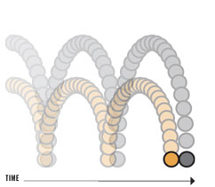
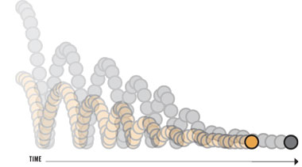
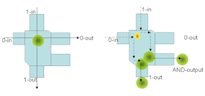
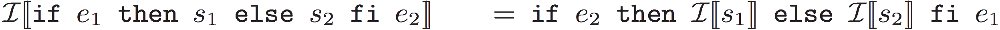

---

# Janus

A reversible programming language.

Not turing complete!

---

# Reversibility

Every statement can be reverted.
No history is stored.

```haskell
x += y * 3
```

. . .

```haskell
x -= y * 3
```

---

# Injective functions
Reversible languages can only compute injective functions.

\begin{equation}
\forall x, y: f(x) = f(y) \implies x = y
\end{equation}

Every output has only a single input.

. . .

\begin{equation}
h(x) = (x, g(x))
\end{equation}

---

# Turing completeness
Turing machines can compute non-injective functions.

Reversible languages are not turing complete.

Reversible Turing complete.

---

# Turing machines

Infinite tape of memory

Finite set of states

Transition function

- Current state
- Current symbol on tape
- Write symbol
- Move tape pointer
- Next state

---

# Turing machines

\emph{Forward deterministic}: given any state and tape, there is at most one transition \emph{from} that state.

\emph{Backward deterministic}: given any state and tape, there is at most one transition \emph{to} that state.

$P$ is the class of forward deterministic turing machines, $NP$ of non-deterministic turing machines.

Reversible Turing complete: a language that can simulate forward and backward deterministic turing machines.

---

# What do reversible languages compute

Given a forward deterministic turing machine that computes $f(x)$,

There exists a reversible turing machine that computes $x \rightarrow (x, f(x))$.

More memory.

---

# Motivation

What are reasons to pursue logically reversible computations?

. . . 
 
* More heat efficient circuitry

. . . 

* Quantum computing

# A small detour

Let's venture into the realm of physics:

Imagine a set of balls bouncing around in a frictionless world:

# Bouncing balls 1

{width=40%}

. . . 

All information about both future and past configurations is preserved.

# Bouncing balls 2

{width=40%}

. . . 

Information about past configurations gets lost as the balls lose velocity.

---

This information is not truely lost, however.

. . .  

Entropy of the system must increase or remain equal. In this case, **heat** is
dissipated into the environment.

---

# Landauer's principle

In computers, information about past states is often lost (or erased) as computations
are carried out. 

. . . 

However, the second law of thermodynamics still applies. 

---

This means that circuits *must* dissipate some amount of heat as information gets destroyed. 

. . . 

Commonly refered to as **Landauer's principle**. 

# Reversible computing

{width=75%}

. . . 

This is also refered to as a **Toffoli gate**. 

---

Toffoli gates are mainly theoretical

. . . 

But ciruits with energy dissipation below the von Neumann-Landauer limit have been built. 

# Quantum Computing

How does all this apply to quantum computing?

. . . 

The underlying physical processes of quantum computing are actually fundamentally reversible.

---

Similar to the frictionless billiard ball gate, information cannot leave a quantum circuit in the 
form of heat. 

The system is said to be **locigally reversible**.

# Logical reversiblity 

Since all logical information is preserved in such systems, it is imposible to carry out certain computations.

Specifically, it is impossible to carry out computations that reach a logical state that can also be reached through
other paths of computation. 

. . . 

Notice the similarity with reversible Turing machines!

# Variables

- All global variables
- Default value
- Modification operators
- Only support for ```+=```, ```-=``` and ```^=```

---

# Limitations

- There is no ```*=``` and ```/=```
- A variable that occurs on the left can not occur on the right in the same statement
    - ```x-=x``` is forbidden

```haskell
a b c

procedure main
    a += 3
    b -= a + 4
    c += a - b
```

# Procedures

- No parameters
- There exists a version with parameters
- Pass by reference

```haskell
a
procedure main
    call f
    uncall g

procedure f
    a += 3

procedure g
    a -= 5
    a += 1
```
---

# Loop

```haskell
    from e1 do
        s1
    loop
        s2
    until e2
```
- ```e1``` is true only the first iteration, false every other iteration
- ```s1``` is executed after ```e1``` on every iteration
- ```e2``` is false until the last run
- ```s2``` is executed if ```e2``` is true, continue to ```e1```

---

# Loop

```haskell
a
b

procedure main
    from a = 0 do
        a += 1
    loop
        b += a
    until a = 10
```
The result is `{ a = 10, b = 45 }`

---

# Example

`fib`: calculates (n+1)-th and (n+2)-th Fibonacci number.
```haskell
procedure fib
    if n = 0 then
        x1 += 1    ; -- 1st Fib nr is 1.
        x2 += 1    ; -- 2nd Fib nr is 1.
    else
        n -= 1
        call fib
        x1 += x2
        x1 <=> x2
    fi x1 = x2
```

---

# Example

`fib`: calculates (n+1)-th and (n+2)-th Fibonacci number.
```haskell
procedure fib
    if n = 0 then
        x1 += 1    ; -- 1st Fib nr is 1.
        x2 += 1    ; -- 2nd Fib nr is 1.
    else
        n -= 1
        call fib
        x1 += x2
        x1 <=> x2
    fi x1 = x2     ; -- Why do we need this?
```

. . .

* Q: How do we calculate the inverse?

---

# Example

`fib`: calculates (n+1)-th and (n+2)-th Fibonacci number.
```haskell
procedure fib
    if n = 0 then
        x1 += 1    ; -- 1st Fib nr is 1.
        x2 += 1    ; -- 2nd Fib nr is 1.
    else
        n -= 1
        call fib
        x1 += x2
        x1 <=> x2
    fi x1 = x2     ; -- Used for inverting the if-statement.
```
{ width=100% }\

---

# Example

`fib`: calculates (n+1)-th and (n+2)-th Fibonacci number.
```haskell
procedure fibInverse
    if x1 = x2 then
        x2 -= 1          ; -- 2nd Fib nr is 1.
        x1 -= 1          ; -- 1st Fib nr is 1.
    else
        x1 <=> x2
        x1 -= x2
        call fibInverse
        n += 1
    fi n = 0
```
---

# Example

```fib```: calculates (n+1)-th and (n+2)-th Fibonacci number.

* Q: What does the inverse of fib do?

```haskell
procedure fibInverse
    if x1 = x2 then
        x2 -= 1          ; -- 2nd Fib nr is 1.
        x1 -= 1          ; -- 1st Fib nr is 1.
    else
        x1 <=> x2
        x1 -= x2
        call fibInverse
        n += 1
    fi n = 0
```
---

# Relational Programming
\small
\renewcommand{\arraystretch}{1.5}
\begin{tabular}{c|c}
  \textbf{Injective Programming} & \textbf{Relational Programming} \\
  $r$-Turing Complete & Turing Complete \\
  backwards deterministic & backwards non-deterministic \\
  restricted language constructs & search procedure (aka \textit{resolution}) \\
\end{tabular}
\normalsize

# Prolog basics
A logic program consists of *facts* and *rules*.
```prolog
parent(alice, joe).
parent(bob, joe).
parent(joe, mary).
parent(gloria, mary).

ancestor(X, Y) :- parent(X, Y).
ancestor(X, Y) :- parent(X, Z), ancestor(Z, Y).

descendant(X, Y) :- ancestor(Y, X).
```
---

The user can then *query* the runtime system, as such:
```prolog
?- ancestor(alice, mary).
true.

?- parent(X, mary).
X = joe;
X = gloria.

?- ancestor(X, mary), not parent(X, mary).
X = alice;
X = bob.
```

# Demonstration - Type Predicate
Assume a `type` predicate, relating expressions with types:
```prolog
type(expr, t) :- ... .
```
. . .

You would normally use it to perform *type-checking*:
```prolog
?- type(1 + 1, int).
true.
?- type(1 + 1, string).
false.
```
---

But you can also perform *type-inference*:
```prolog
?- type(1 + 1, Type).
Type = int.
?- type("hello world", Type).
Type = string.
?- type(λx:int -> x, Type).
Type = int -> int.
?- type(λx -> x, int -> Type).
Type = int.
```
---

Going in the reverse direction, you can generate programs:
```prolog
?- type(Expr, int).
Expr = 1;
Expr = 2;
...
Expr = 1 + 1;
Expr = 1 + 2;
...
Expr = if true then 1 else 1;
...
```
Of course, this does not make much sense without a sufficiently expressive type system.

# Demonstration - Relational Interpreter

Assume you have implemented a *relational interpreter*:
```prolog
eval(program, result) :- ... .

?- eval(map (+ 1) [1 2 3], Result).
Result = [2 3 4].
```
. . .

Non-deterministic constructs are also natural:
```prolog
?- eval(amb [a, b, c], Result).
Result = a;
Result = b;
Result = c.
```
---

But you can also perform *program synthesis* by-example:
```prolog
?- eval(F 1, 2),...,eval(map F [1 2 3], [2 3 4]).
...
F = λx -> x + 1;
...
F = λx -> x - 10 + 10 + 1;
...
```
. . .

Quine generation is straightforward:
```prolog
?- eval(Quine, Quine).
...
Quine = (λa -> a ++ show a) "(λa -> a ++ show a) ";
...
```

# Logic Programming IRL
In practice, bi-directionality breaks with the usage of *extra-logical* features:

* **Variable projection**: inspecting values at runtime
* **Cut (!)**: disables backtracking in certain places
* **Assert/Retract**: dynamically insert/remove facts

. . .

**MiniKanren** is a more recent logic programming language, which avoids extra-logical
features (as much as possible).

# Higher abstraction
* Relational programming, as well as functional programming, both belong to the
*declarative* paradigm.
* They both focus on *what* a program does, rather than *how*.

. . .

\centering
\textbf{Question}

\textit{How can we combine them, to get the best of both worlds?}

# Hanus: Janus embedded in Haskell
In our research project, we use *TemplateHaskell* and *QuasiQuotation* to embed
Janus in Haskell:
```haskell
[hanus| procedure encode(im :: Image, ret :: [Byte]) {
    -- Janus commands with antiquotation
}|]
encode :: Image -> [Byte]
encode = call encode
decode :: [Byte] -> Image
decode = uncall encode
```
{ width=8% }\ \ Come and check out our poster in de Vagant!

# Thanks! Questions?
\centering
{ width=85% }\
\tiny{From CodeComics.com, modified. }

---

# References
Axelsen, Holger Bock, and Robert Glück. "What do reversible programs compute?." FoSSaCS. 2011.
Yokoyama, Tetsuo, and Robert Glück. "A reversible programming language and its invertible self-interpreter." Proceedings of the 2007 ACM SIGPLAN symposium on Partial evaluation and semantics-based program manipulation. ACM, 2007.

<!-- Local Variables:  -->
<!-- pandoc/write: beamer -->
<!-- pandoc/latex-engine: "xelatex" -->
<!-- pandoc/template: "beamer-template.tex" -->
<!-- End:  -->
